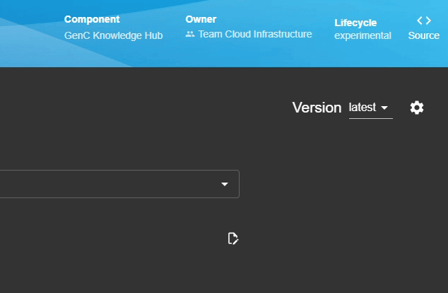
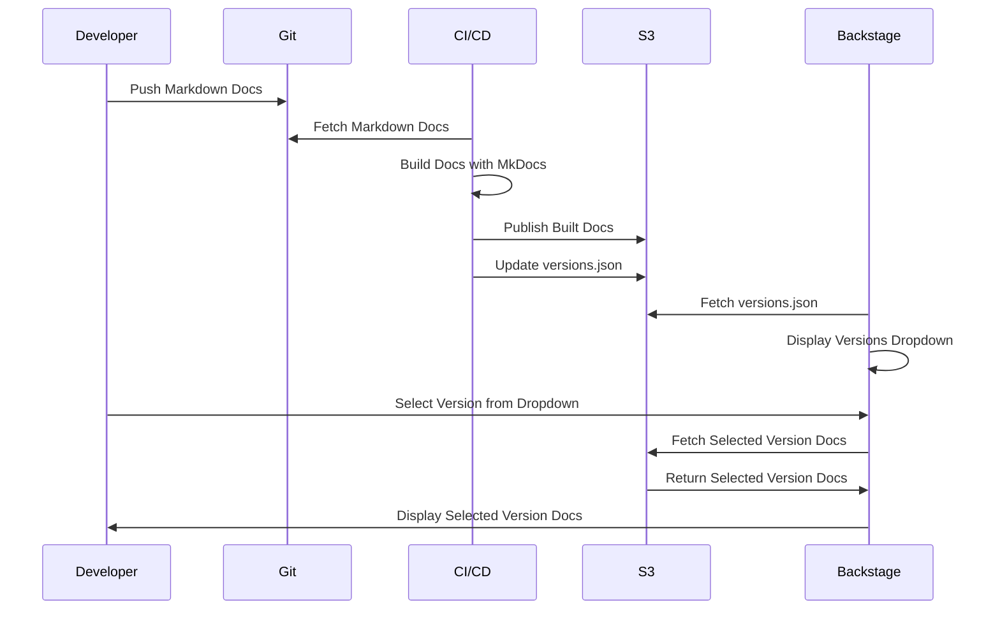
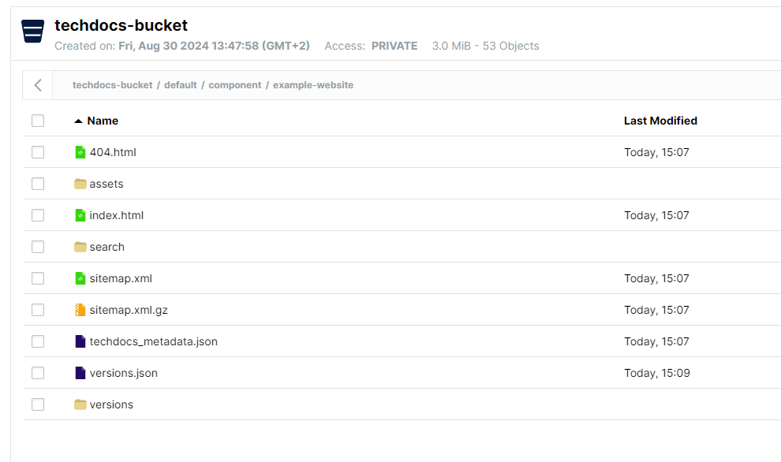
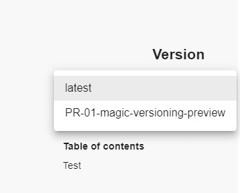

# TechDocs Versioning Addon

This repository contains the TechDocs Versioning Addon for [Backstage](https://backstage.io). It is currently work in progress and not yet ready for production use.

It's goal is to provide a way to manage and display different versions of documentation within Backstage, e.g. for different branches or tags or even as preview for a pull request.

Solves [issue #16711](https://github.com/backstage/backstage/issues/16711).



## Overview

The TechDocs Versioning Component is designed to manage and display different versions of documentation within Backstage. It allows users to select and switch between various versions of documentation for a given entity.

## Key Features

- **Version Selection**: Users can select different versions of documentation from a dropdown menu.
- **Session Storage**: The component uses session storage to remember the selected version across page reloads.
- **Entity Metadata Retrieval**: It fetches metadata about the entity and available documentation versions from the backend (connected storage such as S3)
- **Hybrid Build**: The plugin supports a hybrid build setup, meaning the docs can be built locally (inside backstage) if they are not found in the external storage. Backstage will then upload the built docs to the external storage. This does only work for the "main" build, not for different versions. For more information, see the [TechDocs documentation - How to implement a hybrid build strategy](https://backstage.io/docs/features/techdocs/how-to-guides/#how-to-implement-a-hybrid-build-strategy).

## TechDocs Versioning Workflow



### Explanation

1. **Markdown Docs in Git**: The documentation is written in Markdown and stored in a Git repository.
2. **Build Job**: A CI/CD pipeline fetches the Markdown docs from Git and builds them using MkDocs.
3. **Publish to S3**: The built documentation is published to an S3 bucket. If there are multiple versions, a `versions.json` file is created or updated to include the names of the different versions.
4. **Versions Dropdown**: Backstage fetches the `versions.json` file from S3 and displays the available versions in a dropdown menu.
5. **Version Selection**: When a user selects a version from the dropdown, Backstage fetches the corresponding documentation from the S3 bucket. Each version has its own subdirectory under `/versions/` where the CI job publishes the built docs.
6. **Display Docs**: The selected version of the documentation is then displayed to the user in Backstage.

## Quick start (development)

To test the TechDocs Versioning Addon locally, you can follow these steps:

- Clone the repository
- Install dependencies with `yarn install`
- Install mkdocs with the techdocs core with `pip3 install mkdocs-techdocs-core` to be able to build docs locally.
- Make sure to have Docker and Docker Compose installed
- Start minio and backstage with the `run.sh` script (make sure to make it executable with `chmod +x run.sh`)
- This will start minio on `http://localhost:9001` and automatically create a bucket and user credentials that are automatically configured in the backstage backend.
- Visit `http://localhost:3000/catalog/default/component/example-website/docs/` to trigger a build of the example website that is automatically published to the minio bucket.
- Visit `http://localhost:9001/browser/techdocs-bucket/default%2Fcomponent%2Fexample-website%2F` to see the published docs in the minio bucket (credentials are `minioadmin` and `minioadmin`)
- Simulate a new version by copying the content of the `./versioned-techdocs` folder to the root of the example website in the minio bucket.
  
  It should look like this:



- Reload the page in Backstage and you should be able to select the new version from the dropdown.



## Usage

> :warning: **Attention! WIP**
>
> The Addon is currently work in progress and not yet ready for production use. There is no official release yet, that you can use in your Backstage application. Feel free to contribute to the development, by forking the repository, opening issues or pull requests.

---

To use the TechDocs Versioning Component, include it in your Backstage application where you want to provide versioning functionality for documentation. Ensure that your backend is configured to serve the necessary metadata and version files.

### Frontend

```tsx
// packages/app/src/components/catalog/EntityPage.tsx
import { TechDocsVersioning } from 'backstage-plugin-techdocs-addon-versioning';

const techdocsContent = (
  <EntityTechdocsContent>
    <TechDocsAddons>
      <TechDocsVersioning />
  </EntityTechdocsContent>
);
```

```tsx
// packages/app/src/App.tsx
import { TechDocsVersioning } from 'backstage-plugin-techdocs-addon-versioning';

const routes = (
  <FlatRoutes>
    ...
    <Route path="/docs" element={<TechDocsIndexPage />} />
    <Route
      path="/docs/:namespace/:kind/:name/*"
      element={<TechDocsReaderPage />}
    >
      <TechDocsAddons>
        <TechDocsVersioning />
      </TechDocsAddons>
    </Route>
```

### Backend

The TechDocs Versioning Addon requires the TechDocs plugin to be configured with a backend that serves the necessary metadata and version files.
In this example there is also a custom build strategy configured, which is not necessary for the versioning addon, but can be used to build the docs locally if they are not found in the external storage.

For more information on the hybrid build strategy, see the [TechDocs documentation - How to implement a hybrid build strategy](https://backstage.io/docs/features/techdocs/how-to-guides/#how-to-implement-a-hybrid-build-strategy).

```ts
// packages/backend/src/plugins/techdocs-backend-module-versions.ts

import {
  coreServices,
  createBackendModule,
  LoggerService,
  RootConfigService,
} from '@backstage/backend-plugin-api';
import { S3Client, GetObjectCommand, S3ClientConfig } from '@aws-sdk/client-s3';
import { Entity } from '@backstage/catalog-model';
import {
  DocsBuildStrategy,
  techdocsBuildsExtensionPoint,
} from '@backstage/plugin-techdocs-node';

export class TechDocsBuildStrategy implements DocsBuildStrategy {
  private readonly config: RootConfigService;
  private readonly s3Client: S3Client;
  private readonly logger: LoggerService;

  constructor(config: RootConfigService, logger: LoggerService) {
    this.config = config;
    this.logger = logger;
    this.s3Client = new S3Client({
      region: this.config.get('techdocs.publisher.awsS3.region'),
      credentials: {
        accessKeyId: this.config.get(
          'techdocs.publisher.awsS3.credentials.accessKeyId',
        ),
        secretAccessKey: this.config.get(
          'techdocs.publisher.awsS3.credentials.secretAccessKey',
        ),
      },
      endpoint: this.config.get('techdocs.publisher.awsS3.endpoint'),
      forcePathStyle: true, // needed with minio to set the bucket name as a path instead of a subdomain to avoid SSL issues
    } as S3ClientConfig);
  }

  /**
   * Checks whether the entity should be built locally if no index.html can be found in the S3 bucket for the current entity.
   *
   * @param params.entity The entity to check
   * @returns A boolean indicating whether the entity should be built locally
   */
  async shouldBuild(params: { entity: Entity }): Promise<boolean> {
    const entityKey = `${params.entity.metadata.namespace}/${params.entity.kind}/${params.entity.metadata.name}/versions.json`;

    return new Promise<boolean>(resolve => {
      this.s3Client
        .send(
          new GetObjectCommand({
            Bucket: this.config.get('techdocs.publisher.awsS3.bucketName'),
            Key: entityKey.toLowerCase(),
          }),
        )
        .then(() => {
          this.logger.info(
            `Entity ${params.entity.metadata.name} exists in S3. Loading the docs from S3...`,
          );
          resolve(false);
        })
        .catch((err: Error) => {
          this.logger.info(
            `Entity ${params.entity.metadata.name} does not exist in S3. Rebuilding the docs locally...`,
          );
          this.logger.debug(
            `Error loading entity ${params.entity.metadata.name} from S3: ${err}`,
          );
          resolve(true);
        });
    });
  }
}

export const techdocsModuleVersions = createBackendModule({
  pluginId: 'techdocs',
  moduleId: 'versioning',
  register(reg) {
    reg.registerInit({
      deps: {
        logger: coreServices.logger,
        config: coreServices.rootConfig,
        techdocs: techdocsBuildsExtensionPoint,
      },
      async init({ logger, config, techdocs }) {
        const techDocsBuildStrategy = new TechDocsBuildStrategy(config, logger);
        techdocs.setBuildStrategy(techDocsBuildStrategy);
      },
    });
  },
});

```

Add it to the backend in the index.ts file.

```ts
// packages/backend/src/index.ts
import { techdocsModuleVersions } from './plugins/techdocs-backend-module-versions';

...
// add techdocs-backend-module-versions
backend.add(techdocsModuleVersions);

```

## Configuration

```yaml
techdocs:
  builder: 'local' # The plugin is able to do a hybrid build, meaning it can build the docs locally if they are not found in the external storage. It will then upload the built docs to the external storage. This does only work for the "main" build, not for different versions.
  generator:
    runIn: 'local'
  publisher:
    type: 'awsS3'
    awsS3:
      bucketName: ${TECHDOCS_S3_BUCKET_NAME}
      bucketRootPath: '/'
      accountId: '123456789012' # only a placeholder, account id is not needed for own S3 (minio)
      endpoint: ${TECHDOCS_S3_ENDPOINT}
      s3ForcePathStyle: true
      credentials:
        accessKeyId: ${TECHDOCS_S3_ACCESS_KEY_ID}
        secretAccessKey: ${TECHDOCS_S3_SECRET_ACCESS_KEY}
      region: ${TECHDOCS_S3_REGION}
  # techdocs.cache requires backend.cache to be configured with a valid cache store.
  cache:
    # Represents the number of milliseconds a statically built asset should
    # stay cached. Cache invalidation is handled automatically by the frontend,
    # which compares the build times in cached metadata vs. canonical storage,
    # allowing long TTLs (e.g. 1 month/year)
    ttl: 60000
    # (Optional) The time (in milliseconds) that the TechDocs backend will wait
    # for a cache service to respond before continuing on as though the cached
    # object was not found (e.g. when the cache sercice is unavailable). The
    # default value is 1000
    #readTimeout: 500
```

### Expected folder structure in S3

```plaintext
bucket-name/namespace/kind/
│
└───example-website
    ├── 404.html
    ├── assets/
    ├── index.html
    ├── search/
    ├── sitemap.xml
    ├── sitemap.xml.gz
    ├── techdocs_metadata.json
    ├── versions
    │   └── MR-1-improve-docs
    │       ├── 404.html
    │       ├── assets/
    │       ├── docs
    │       │   └── aic
    │       │       └── index.html
    │       ├── index.html
    │       ├── search/
    │       ├── sitemap.xml
    │       ├── sitemap.xml.gz
    │       └── techdocs_metadata.json
    └── versions.json
```

### versions.json

The versions.json file is really basic atm. It just contains an array of strings, which are the names of the different versions. The name must match the name of the folder in the versions directory.

```json
[
    "MR-1-improve-docs"
]
```

It was planned to extend this file with more metadata, but this is not implemented yet.
